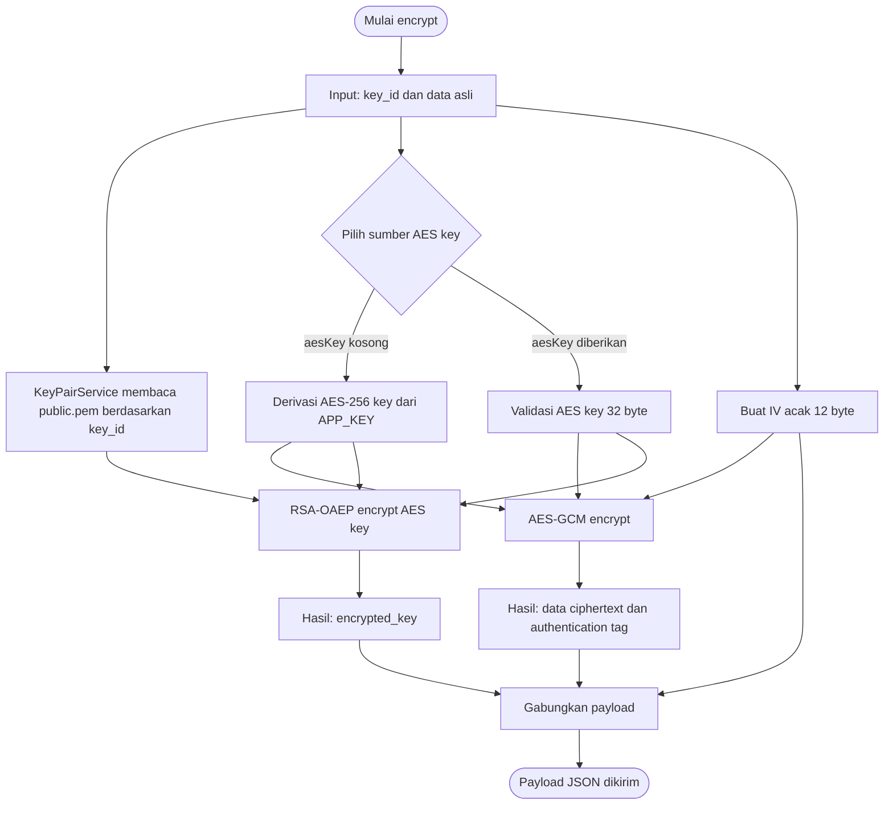
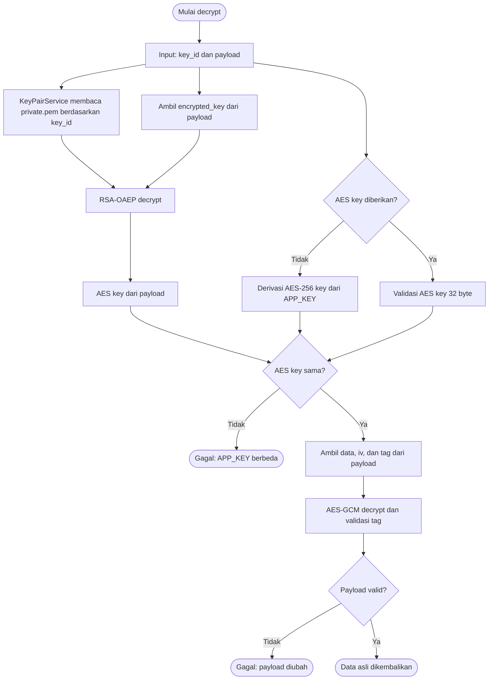
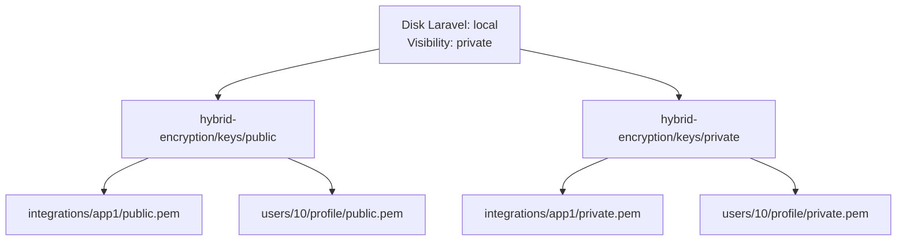

# Laravel Hybrid Encryption

Package Laravel untuk mengenkripsi payload menggunakan AES-256-GCM dan RSA-OAEP. AES key dapat berasal dari `APP_KEY` Laravel atau diberikan oleh aplikasi sebagai AES key generated.

## Alur encrypt dan decrypt

### Flowchart encrypt



Hasil encrypt tidak menyimpan data asli. Payload hanya berisi `encrypted_key`, `iv`, `tag`, dan `data`.

### Flowchart decrypt



Urutannya adalah: RSA membuka AES key terlebih dahulu, kemudian AES-GCM membuka data. Jika `$aesKey` tidak diberikan, plugin menggunakan `APP_KEY`; jika `$aesKey` diberikan, plugin menggunakan key tersebut pada encrypt dan decrypt.

Jika `APP_KEY` berbeda, validasi AES key gagal. Jika RSA private key tidak cocok dengan public key yang digunakan saat encrypt, `encrypted_key` tidak dapat dibuka.

## Struktur penyimpanan key



Public dan private key berada pada disk yang sama, tetapi prefix/folder-nya berbeda. Visibility default keduanya adalah `private`.

## Persyaratan

- PHP `^8.2`.
- Laravel dengan `illuminate/support` versi `10`, `11`, `12`, atau `13`.
- Ekstensi PHP OpenSSL aktif.
- Composer.

## Instalasi

Di project Laravel:

```bash
composer require aptika/laravel-hybrid-encryption
php artisan vendor:publish --tag=hybrid-encryption-config
php artisan hybrid-encryption:generate-key-pair default
```

Laravel menemukan service provider dan facade melalui Composer auto-discovery. Jika auto-discovery dinonaktifkan, daftarkan provider berikut secara manual:

```php
Aptika\HybridEncryption\HybridEncryptionServiceProvider::class,
```

Command tersebut menghasilkan pasangan key pada disk dan prefix yang dikonfigurasi:

```text
storage/app/hybrid-encryption/keys/public/default/public.pem
storage/app/hybrid-encryption/keys/private/default/private.pem
```

Simpan `private.pem` hanya di server penerima. Jangan commit atau mengirimkannya ke project lain.

## Konfigurasi

File `config/hybrid-encryption.php`:

```php
return [
    'cipher' => 'aes-256-gcm',
    'rsa_bits' => (int) env('APTIKA_HYBRID_ENCRYPTION_RSA_BITS', 3072),
    'key_storage' => [
        'disk' => env('APTIKA_HYBRID_ENCRYPTION_KEY_DISK', 'local'),
        'visibility' => env('APTIKA_HYBRID_ENCRYPTION_KEY_VISIBILITY', 'private'),
        'public_prefix' => env('APTIKA_HYBRID_ENCRYPTION_PUBLIC_PREFIX', 'hybrid-encryption/keys/public'),
        'private_prefix' => env('APTIKA_HYBRID_ENCRYPTION_PRIVATE_PREFIX', 'hybrid-encryption/keys/private'),
    ],
];
```

Override lokasi key bila diperlukan:

```dotenv
APTIKA_HYBRID_ENCRYPTION_RSA_BITS=3072
```

`cipher` saat ini ditetapkan package sebagai `aes-256-gcm`. `rsa_bits` digunakan saat membuat key baru.

Jika AES key tidak diberikan pada method, package menggunakan `APP_KEY` Laravel. Jika AES key diberikan pada method, package menggunakan AES key tersebut dan tidak menyimpannya.

`key_storage` digunakan untuk key pair per user atau per fitur. Public dan private key disimpan pada satu disk Laravel yang sama, tetapi foldernya berbeda. Default-nya adalah disk `local` dengan visibility `private`:

```dotenv
APTIKA_HYBRID_ENCRYPTION_KEY_DISK=local
APTIKA_HYBRID_ENCRYPTION_KEY_VISIBILITY=private
APTIKA_HYBRID_ENCRYPTION_PUBLIC_PREFIX=hybrid-encryption/keys/public
APTIKA_HYBRID_ENCRYPTION_PRIVATE_PREFIX=hybrid-encryption/keys/private
```

Visibility `private` membuat file key tidak ditujukan untuk akses URL publik. Pastikan disk yang digunakan memang tidak diekspos langsung oleh web server.

## Pemakaian dasar

```php
use Aptika\HybridEncryption\Facades\HybridEncryption;

$keyId = 'default';
$payload = HybridEncryption::encrypt($keyId, [
    'nik' => '750101xxxxxxxxxx',
    'nama' => 'Alfandy',
]);

$data = HybridEncryption::decrypt($keyId, $payload);
// ['nik' => '750101xxxxxxxxxx', 'nama' => 'Alfandy']
```

Untuk AES key hasil generate, berikan key yang sama saat encrypt dan decrypt:

```php
$aesKey = env('FEATURE_BANTUAN_AES_KEY'); // format base64:... atau 32 byte

$payload = HybridEncryption::encrypt(
    'features/bantuan',
    'alfandy',
    $aesKey
);

$data = HybridEncryption::decrypt(
    'features/bantuan',
    $payload,
    $aesKey
);
```

Dependency injection juga tersedia:

```php
use Aptika\HybridEncryption\Services\HybridEncryptionService;

public function store(HybridEncryptionService $crypto)
{
    return response()->json($crypto->encrypt('features/example', ['message' => 'rahasia']));
}
```

`encrypt()` menerima `key_id` dan array/string. Hasilnya berupa array payload yang dapat dikirim langsung oleh Laravel atau diubah menjadi satu string JSON. `decrypt()` menerima `key_id` dan payload dalam bentuk array atau string JSON, lalu mengembalikan JSON object/array sebagai associative array; plaintext yang bukan JSON dikembalikan sebagai string.

Contoh mengirim payload sebagai satu string:

```php
$payloadArray = $crypto->encrypt('integrations/app1', $data);
$payloadString = json_encode($payloadArray, JSON_THROW_ON_ERROR);

Http::withBody($payloadString, 'application/json')
    ->post('https://app2.test/api/receive');
```

Di aplikasi penerima:

```php
$data = $crypto->decrypt(
    'integrations/app1',
    $request->getContent()
);
```

## Pertukaran data antar project

1. Di project B buat key pair:

   ```bash
   php artisan hybrid-encryption:generate-key-pair features/antar-project
   ```

2. Pastikan A dan B memiliki akses ke public key B melalui disk yang sesuai. Jika memakai AES generated, simpan AES key yang sama pada secret manager kedua aplikasi.
3. Di A gunakan `key_id` B:

   ```php
   use Aptika\HybridEncryption\Services\HybridEncryptionService;

   $payload = app(HybridEncryptionService::class)->encrypt(
       'features/antar-project',
       ['nik' => '750101xxxxxxxxxx', 'nama' => 'Alfandy']
   );
   ```

4. Kirim payload melalui HTTPS ke B.
5. Di B decrypt dengan private key B:

   ```php
   use Aptika\HybridEncryption\Facades\HybridEncryption;
   use Illuminate\Http\Request;

   public function receive(Request $request)
   {
       return response()->json([
           'success' => true,
           'data' => HybridEncryption::decrypt('features/antar-project', $request->all()),
       ]);
   }
   ```

Public key boleh dibagikan kepada pengirim; private key tidak boleh dibagikan.

## Key berbeda untuk setiap user atau fitur

Buat key pair menggunakan `key_id` yang stabil dan aman, misalnya:

```bash
php artisan hybrid-encryption:generate-key-pair users/10/profile
php artisan hybrid-encryption:generate-key-pair features/bantuan
php artisan hybrid-encryption:generate-key-pair features/bantuan --aes-source=generated
```

Tanpa `--aes-source`, command menanyakan pilihan `app_key` atau `generated`. Mode `app_key` menggunakan `APP_KEY` Laravel. Jika belum tersedia, command menjalankan `php artisan key:generate` tanpa menimpa `APP_KEY` yang sudah ada. Mode `generated` membuat AES key acak 32 byte, menampilkannya satu kali, dan tidak menyimpan file AES.

Key tersebut disimpan berdasarkan konfigurasi disk, dengan pola:

```text
disk (public): hybrid-encryption/keys/public/users/10/profile/public.pem
disk (private): hybrid-encryption/keys/private/users/10/profile/private.pem
```

Gunakan service baru berikut agar setiap request memilih key tanpa mengubah konfigurasi global:

```php
use Aptika\HybridEncryption\Services\HybridEncryptionService;

$crypto = app(HybridEncryptionService::class);
$keyId = "users/{$user->id}/profile";

$payload = $crypto->encrypt($keyId, [
    'user_id' => $user->id,
    'email' => $user->email,
]);

$data = $crypto->decrypt($keyId, $payload);
```

API key pair yang tersedia:

```php
use Aptika\HybridEncryption\Services\KeyPairService;

$keys = app(KeyPairService::class);
$paths = $keys->generate('users/10/profile');
$publicPem = $keys->publicKey('users/10/profile');
$privatePem = $keys->privateKey('users/10/profile');
```

`key_id` boleh menggunakan huruf, angka, titik, garis bawah, dan garis miring. Jangan mengambil `key_id` mentah dari input pengguna tanpa validasi aplikasi.

## Bentuk payload

```json
{
  "version": 3,
  "alg": "RSA-OAEP+A256GCM",
  "aes_source": "app_key",
  "encrypted_key": "base64...",
  "iv": "base64...",
  "tag": "base64...",
  "data": "base64..."
}
```

| Field | Keterangan |
| --- | --- |
| `version` | Versi format payload, saat ini `3`. |
| `alg` | Penanda kombinasi algoritma. |
| `aes_source` | Informasi sumber AES: `app_key` atau `provided`; bukan AES key. |
| `encrypted_key` | Kunci AES yang dienkripsi RSA-OAEP. |
| `iv` | Initialization vector AES-GCM 12 byte, dalam Base64. |
| `tag` | Authentication tag AES-GCM, dalam Base64. |
| `data` | Ciphertext payload, dalam Base64. |

Semua field selain `version` dan `alg` wajib ada saat decrypt. Payload yang diubah atau Base64-nya tidak valid akan ditolak.

## Penjelasan algoritma dan tingkat keamanan

### AES-256-GCM

AES adalah algoritma enkripsi simetris: key yang sama digunakan untuk encrypt dan decrypt. Standar AES mendefinisikan AES-128, AES-192, dan AES-256 dengan block berukuran 128 bit; angka pada nama AES menunjukkan panjang key. Package ini menggunakan AES-256-GCM, sehingga panjang AES key yang dipakai adalah 256 bit. [NIST FIPS 197](https://nvlpubs.nist.gov/nistpubs/FIPS/NIST.FIPS.197-upd1.pdf)

GCM adalah mode authenticated encryption. Selain menghasilkan ciphertext, GCM menghasilkan authentication tag. Saat decrypt, tag harus cocok; jika ciphertext, IV, atau tag diubah, decrypt gagal. Package menyimpan nilai `iv`, `tag`, dan `data` dalam payload. NIST menjelaskan bahwa authenticated decryption hanya menghasilkan plaintext jika tag valid, jika tidak hasilnya gagal. [NIST SP 800-38D](https://nvlpubs.nist.gov/nistpubs/Legacy/SP/nistspecialpublication800-38d.pdf)

Package membuat IV acak sepanjang 12 byte untuk setiap payload dan menggunakan tag default PHP OpenSSL sepanjang 16 byte. IV bukan rahasia dan harus dikirim bersama payload, tetapi IV tidak boleh digunakan ulang dengan key AES yang sama. Dokumentasi PHP menyatakan tag GCM dapat berukuran 4 sampai 16 byte dan default-nya 16 byte. [PHP `openssl_encrypt`](https://www.php.net/openssl_encrypt)

### RSA-OAEP

RSA adalah enkripsi asimetris: public key digunakan untuk encrypt, sedangkan private key pasangannya digunakan untuk decrypt. Package tidak mengenkripsi seluruh data dengan RSA. RSA hanya membungkus AES key, karena RSA memiliki batas panjang pesan dan lebih lambat untuk payload besar.

Package menggunakan padding RSA-OAEP melalui `OPENSSL_PKCS1_OAEP_PADDING`. RSAES-OAEP adalah skema enkripsi yang didefinisikan dalam PKCS #1 v2.2 dan dirancang untuk keamanan terhadap serangan chosen-ciphertext pada asumsi matematis RSA dan parameter yang benar. [RFC 8017, bagian RSAES-OAEP](https://www.rfc-editor.org/rfc/rfc8017.html#section-7.1)

Private key RSA harus dirahasiakan. Public key boleh dibagikan, tetapi integritas public key harus diverifikasi sebelum dipasang pada aplikasi pengirim. Jika public key diganti oleh penyerang, data baru dapat dienkripsi ke key penyerang.

### Perbandingan tingkat keamanan

Tidak ada satu label resmi "tingkat keamanan dunia" yang berlaku untuk semua kondisi. NIST membandingkan algoritma berdasarkan *security strength* dalam bit. Tabel NIST yang dirujuk package menunjukkan perkiraan berikut untuk keamanan klasik:

| Algoritma/key | Perkiraan security strength |
| --- | ---: |
| AES-128 | 128 bit |
| RSA-2048 | 112 bit |
| RSA-3072 | 128 bit |
| AES-256 | 256 bit |

Package secara default membuat RSA-3072. Berdasarkan perbandingan NIST, RSA-3072 kira-kira setara dengan AES-128 dalam *security strength*, bukan AES-256. Karena itu keamanan praktis skema hybrid ini dibatasi oleh komponen RSA-3072 untuk pembungkusan key, sekitar kelas 128-bit secara klasik. AES-256 tetap digunakan untuk isi data, tetapi menambah panjang AES tidak otomatis membuat keseluruhan skema setara RSA-3072 + AES-256. [NIST SP 800-57 Part 1 Revision 5](https://csrc.nist.gov/pubs/sp/800/57/pt1/r5/final)

Implementasi saat ini memakai `OPENSSL_PKCS1_OAEP_PADDING`, tetapi source code tidak memilih digest OAEP secara eksplisit. Karena itu dokumentasi ini tidak mengklaim `RSA-OAEP-SHA-256`. Jika dua runtime membutuhkan parameter OAEP tertentu, parameter tersebut harus ditetapkan eksplisit dan diuji pada kedua aplikasi. [RFC 8017](https://www.rfc-editor.org/rfc/rfc8017.html#section-7.1)

RSA-3072 dan AES-256 merupakan pilihan kuat untuk banyak aplikasi saat ini jika key, APP_KEY, IV, private key, server, dan implementasi dikelola dengan benar. Pernyataan ini adalah penilaian berdasarkan tabel perbandingan NIST, bukan jaminan bahwa aplikasi bebas dari semua serangan.

### Sumber AES key pada package ini

Jika `$aesKey` kosong, package menurunkan AES-256 key dari `APP_KEY` Laravel menggunakan SHA-256 dengan konteks package. Jika `$aesKey` diberikan, package memakai AES key 32 byte tersebut. AES key tidak dikirim sebagai plaintext di payload; RSA membungkus AES key ke field `encrypted_key`.

- Mode `app_key` pada App1 dan App2 harus memakai `APP_KEY` yang sama.
- Mode `generated` pada App1 dan App2 harus memakai AES key generated yang sama.
- Jangan mencatat AES key generated atau `APP_KEY` ke log.
- Mengganti `APP_KEY` membuat payload mode `app_key` lama tidak dapat didekripsi.
- Siapa pun yang memperoleh `APP_KEY` dan private RSA key dapat mencoba membuka payload yang ditujukan kepada aplikasi tersebut.
- Karena `APP_KEY` juga merupakan root key Laravel, kompromi `APP_KEY` dapat berdampak pada fungsi Laravel lain yang menggunakannya. Simpan secret ini di secret manager atau environment yang terlindungi.

Catatan implementasi: proses SHA-256 di sini adalah derivasi deterministik untuk mode `app_key`, bukan password KDF seperti Argon2 atau scrypt. `APP_KEY` harus dibuat oleh Laravel secara acak dan tidak boleh berupa password buatan manusia. Mode `generated` menggunakan 32 byte acak dan tidak disimpan oleh package.

### Batasan keamanan yang perlu ditangani aplikasi

AES-GCM memberikan kerahasiaan dan deteksi perubahan payload, tetapi package ini belum menyediakan seluruh kontrol keamanan aplikasi:

- Tidak ada proteksi replay. Tambahkan `timestamp`, expiry, dan `request_id` unik yang dicatat sebagai sudah diproses.
- Enkripsi dengan public key tidak membuktikan identitas pengirim. Jika perlu autentikasi pengirim, gunakan TLS dengan autentikasi yang benar atau tanda tangan digital terpisah.
- HTTPS tetap wajib untuk melindungi metadata, endpoint, dan proses pertukaran public key.
- Rotasi `APP_KEY` dan RSA key harus direncanakan. Simpan versi/key ID dan lakukan migrasi payload sebelum key lama dihapus.
- RSA-3072 dan AES-256 adalah penilaian keamanan klasik. Dokumen NIST yang dirujuk tidak berarti skema ini post-quantum.

Riset dan pemetaan sumber primer yang lebih lengkap tersedia di [docs/security-references.md](docs/security-references.md).

## Referensi fungsi

### `HybridEncryptionService::encrypt(string $keyId, array|string $data, ?string $aesKey = null): array`

Mengenkripsi array atau string menggunakan public key yang disimpan untuk `$keyId`. Jika `$aesKey` kosong, AES key diturunkan dari `APP_KEY`; jika diisi, key tersebut digunakan. IV dibuat acak untuk setiap payload, plaintext dienkripsi dengan AES-GCM, lalu AES key dibungkus memakai RSA-OAEP.

Melempar `EncryptionException` bila public key tidak ditemukan/tidak valid, pembuatan JSON array gagal, atau proses AES/RSA gagal.

### `HybridEncryptionService::decrypt(string $keyId, array|string $payload, ?string $aesKey = null): array|string`

Memvalidasi field payload, membuka kunci AES menggunakan private key untuk `$keyId`, lalu mendekripsi data dengan AES-GCM. Payload dapat berupa array PHP atau string JSON. Jika payload dibuat dengan AES generated, `$aesKey` yang sama wajib diberikan.

Melempar `DecryptionException` bila field wajib tidak valid, private key gagal dibuka, Base64 tidak valid, RSA gagal, atau authentication tag AES tidak cocok.

### `KeyPairService::generate(string $keyId, bool $force = false): array`

Membuat RSA public/private key pair dan menyimpannya pada disk serta prefix yang dikonfigurasi. Secara default command menolak menimpa key yang sudah ada. `force` hanya digunakan untuk rotasi key yang terencana.

### `KeyPairService::publicKey(string $keyId): string` dan `privateKey(string $keyId): string`

Membaca isi public atau private key dari disk yang sesuai. Jika file tidak ditemukan, method melempar `KeyManagementException`.

### `KeyPairService::paths(string $keyId): array`

Mengembalikan `key_id`, nama disk, dan path public/private key tanpa membaca isi key.

### `GenerateKeyPairCommand::handle(KeyPairService $keys, HybridEncryptionService $crypto): int`

Menjalankan pembuatan key pair berbasis key ID melalui command `hybrid-encryption:generate-key-pair`. Command bertanya apakah memakai `APP_KEY` atau membuat AES key generated. AES generated ditampilkan satu kali, tidak disimpan package, dan harus diamankan oleh pengguna. Command juga menampilkan disk, path public/private key, dan fingerprint AES.

### `HybridEncryptionService::b64(string $value): string`

Helper internal private untuk decode Base64 secara ketat. Melempar `DecryptionException` bila input tidak valid.

### `HybridEncryptionServiceProvider::register(): void`

Memuat konfigurasi default, mendaftarkan `HybridEncryptionService` sebagai singleton dengan binding `hybrid-encryption`, dan membuat alias container untuk dependency injection.

### `HybridEncryptionServiceProvider::boot(): void`

Mendaftarkan publish tag `hybrid-encryption-config` dan command Artisan package saat aplikasi berjalan di console.

### `Facades\HybridEncryption::getFacadeAccessor(): string`

Menghubungkan facade ke binding container `hybrid-encryption`.

### Exception

- `EncryptionException`: kegagalan public key, serialisasi JSON, enkripsi AES, atau enkripsi RSA.
- `DecryptionException`: kegagalan payload, private key, Base64, dekripsi RSA, atau validasi AES.
- `KeyManagementException`: kegagalan validasi `key_id`, pembuatan key, atau pembacaan key dari disk.

Semua exception tersebut mewarisi `RuntimeException` dan dapat ditangkap aplikasi.

## Penanganan error

Jangan kirim detail path key atau exception mentah ke client:

```php
use Aptika\HybridEncryption\Exceptions\DecryptionException;

try {
    $data = HybridEncryption::decrypt('features/example', $request->all());
} catch (DecryptionException $exception) {
    report($exception);

    return response()->json([
        'success' => false,
        'message' => 'Payload tidak dapat diproses.',
    ], 422);
}
```

## Testing

```bash
composer install
composer test
```

Test package membuat RSA key sementara, melakukan encrypt/decrypt, dan memastikan data kembali sama. Untuk memakai checkout lokal dari project Laravel, tambahkan repository path:

```json
"repositories": [
  {"type": "path", "url": "../aptika-encryption", "options": {"symlink": true}}
]
```

Kemudian:

```bash
composer require aptika/laravel-hybrid-encryption:@dev
php artisan hybrid-encryption:generate-key-pair default
```

## Catatan keamanan dan batasan

- Gunakan HTTPS/TLS saat mengirim payload.
- Pada mode `app_key`, `APP_KEY` App1 dan App2 harus sama persis agar AES key hasil derivasi sama. Pada mode `generated`, kedua aplikasi harus menerima AES key generated yang sama.
- Jangan mengganti `APP_KEY` jika payload lama masih diperlukan. Jika diganti, payload lama tidak dapat didekripsi.
- Jangan commit `private.pem`; tambahkan lokasi key ke `.gitignore`.
- `--force` pada command key pair mengganti key dan membuat ciphertext dengan key lama tidak dapat didekripsi oleh key baru.
- Package menyediakan confidentiality dan integrity melalui AES-GCM, tetapi belum menyediakan proteksi replay. Untuk produksi lintas sistem pertimbangkan `timestamp`, `request_id`, `kid`, expiry, dan penyimpanan request ID yang sudah diproses.
- Pastikan permission directory dan private key dibatasi oleh user aplikasi.
- Jangan menyimpan private key pada disk yang dapat diakses publik atau pada response API.
- Jika private key disimpan di database, enkripsi isi key terlebih dahulu menggunakan mekanisme penyimpanan rahasia aplikasi.

## Lisensi

MIT.
