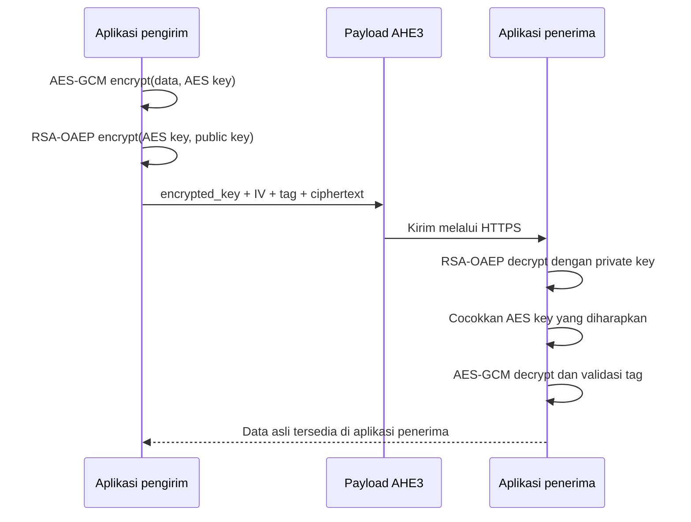

# Keamanan dan algoritma

Dokumen ini menjelaskan desain kriptografi package dan batas klaim
keamanannya. Ini bukan audit keamanan atau sertifikasi aplikasi.

## Hybrid encryption

Package menggunakan dua lapisan:

1. AES-256-GCM mengenkripsi data utama.
2. RSA-OAEP mengenkripsi atau membungkus AES key.

RSA tidak dipakai untuk mengenkripsi seluruh payload karena RSA memiliki batas
ukuran pesan dan lebih lambat untuk data besar.

## AES-256-GCM

AES adalah enkripsi simetris: key yang sama digunakan untuk encrypt dan decrypt.
AES-256 memakai key 256 bit. GCM menambahkan authentication tag sehingga
perubahan ciphertext, IV, atau tag dapat menyebabkan decrypt gagal.

Package membuat IV acak 12 byte setiap encrypt. IV tidak rahasia dan harus
tersedia saat decrypt, tetapi IV tidak boleh digunakan ulang dengan AES key yang
sama. Tag juga harus tersedia saat decrypt.

Sumber: [NIST FIPS 197](https://nvlpubs.nist.gov/nistpubs/FIPS/NIST.FIPS.197-upd1.pdf)
dan [NIST SP 800-38D](https://nvlpubs.nist.gov/nistpubs/Legacy/SP/nistspecialpublication800-38d.pdf).

## RSA-OAEP

Public key digunakan untuk membungkus AES key saat encrypt. Private key hanya
digunakan oleh penerima saat decrypt. Private key harus disimpan rahasia dan
tidak boleh dikirim melalui response API.

Konfigurasi default package membuat RSA 3072-bit dan menggunakan padding
`OPENSSL_PKCS1_OAEP_PADDING`. Digest OAEP tidak dipilih secara eksplisit oleh
implementasi ini, sehingga integrasi lintas runtime perlu diuji dengan versi
PHP/OpenSSL yang digunakan.

Sumber: [RFC 8017 RSAES-OAEP](https://www.rfc-editor.org/rfc/rfc8017.html#section-7.1)
dan [PHP openssl_public_encrypt](https://www.php.net/manual/en/function.openssl-public-encrypt.php).

## Sumber AES key

Jika `$aesKey` kosong, package mengambil material `APP_KEY` Laravel:

- prefix `base64:` dihapus;
- nilai Base64 di-decode;
- hasilnya harus tepat 32 byte.

Jika `$aesKey` diberikan, nilainya harus berupa `base64:` yang menghasilkan 32
byte atau 32 byte mentah. App1 dan App2 harus memakai AES key yang sama.

Package tidak menyimpan AES key generated. Simpan key tersebut di secret manager
atau environment yang terlindungi, bukan di Git, log, frontend, atau payload.

Fingerprint AES adalah hash untuk verifikasi dan bukan AES key. Fingerprint tidak
akan sama dengan teks `APP_KEY`.

## Perbandingan security strength

Perkiraan klasik yang umum dipakai NIST:

| Komponen | Perkiraan security strength |
| --- | ---: |
| AES-128 | 128 bit |
| AES-256 | 256 bit |
| RSA-2048 | 112 bit |
| RSA-3072 | 128 bit |

Dengan RSA-3072 dan AES-256, keseluruhan skema secara konservatif dibatasi oleh
komponen RSA sekitar kelas 128-bit untuk security strength klasik. Ini bukan
jaminan aplikasi bebas dari serangan, kebocoran key, replay, atau kesalahan
konfigurasi.

Sumber: [NIST SP 800-57 Part 1 Rev. 5](https://csrc.nist.gov/pubs/sp/800/57/pt1/r5/final).

## Batasan keamanan aplikasi

- Payload tidak menyediakan proteksi replay. Tambahkan timestamp, expiry, dan request ID yang dicatat sebagai sudah diproses.
- Enkripsi dengan public key tidak membuktikan identitas pengirim.
- Gunakan HTTPS/TLS dan autentikasi endpoint.
- Rotasi `APP_KEY` dan RSA key harus direncanakan sebelum key lama dihapus.
- Revoke private key membuat payload lama yang bergantung pada key tersebut tidak dapat didekripsi.
- Jangan menampilkan private key atau AES key pada log dan response yang tidak terlindungi.

Referensi primer tambahan tersedia di [security-references.md](security-references.md).
