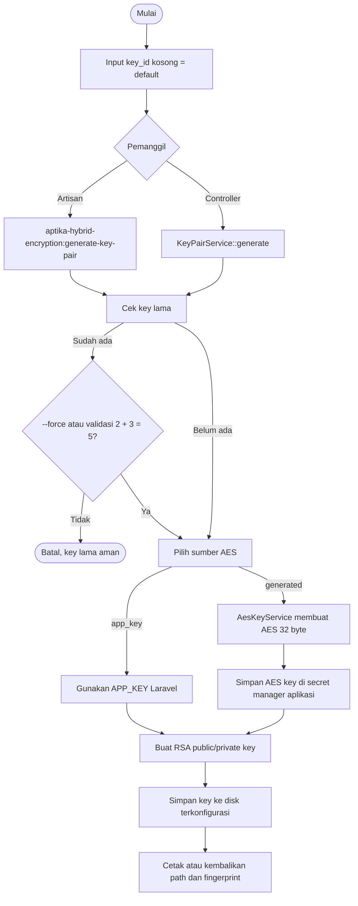
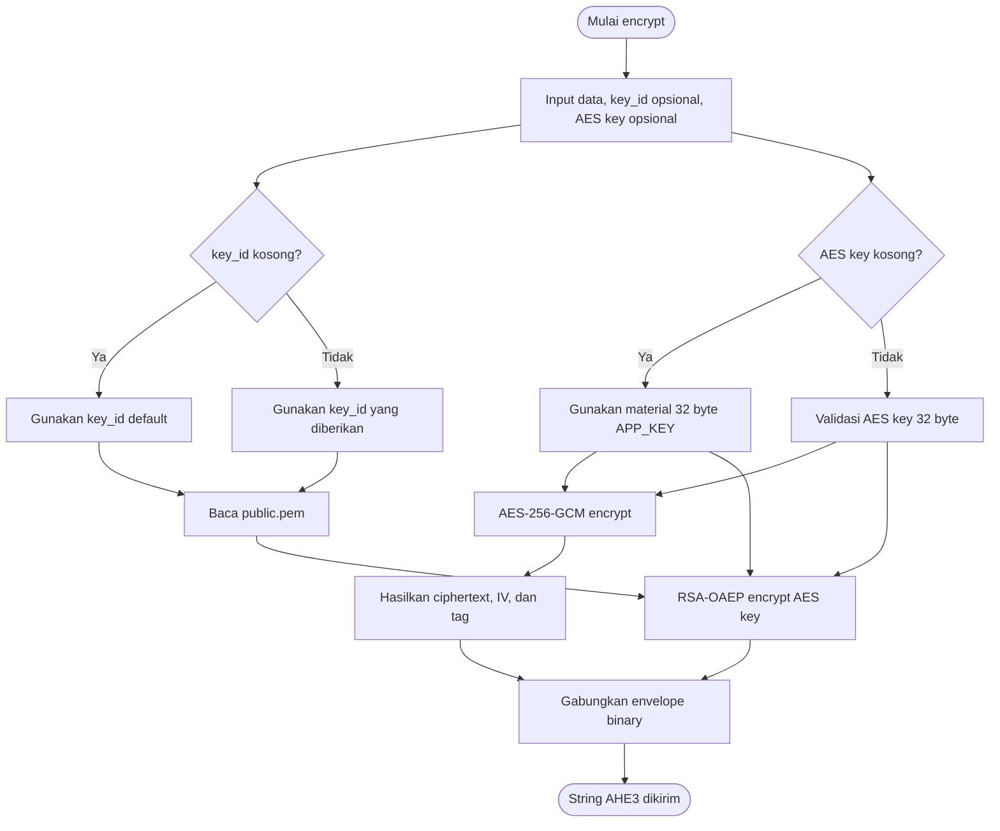
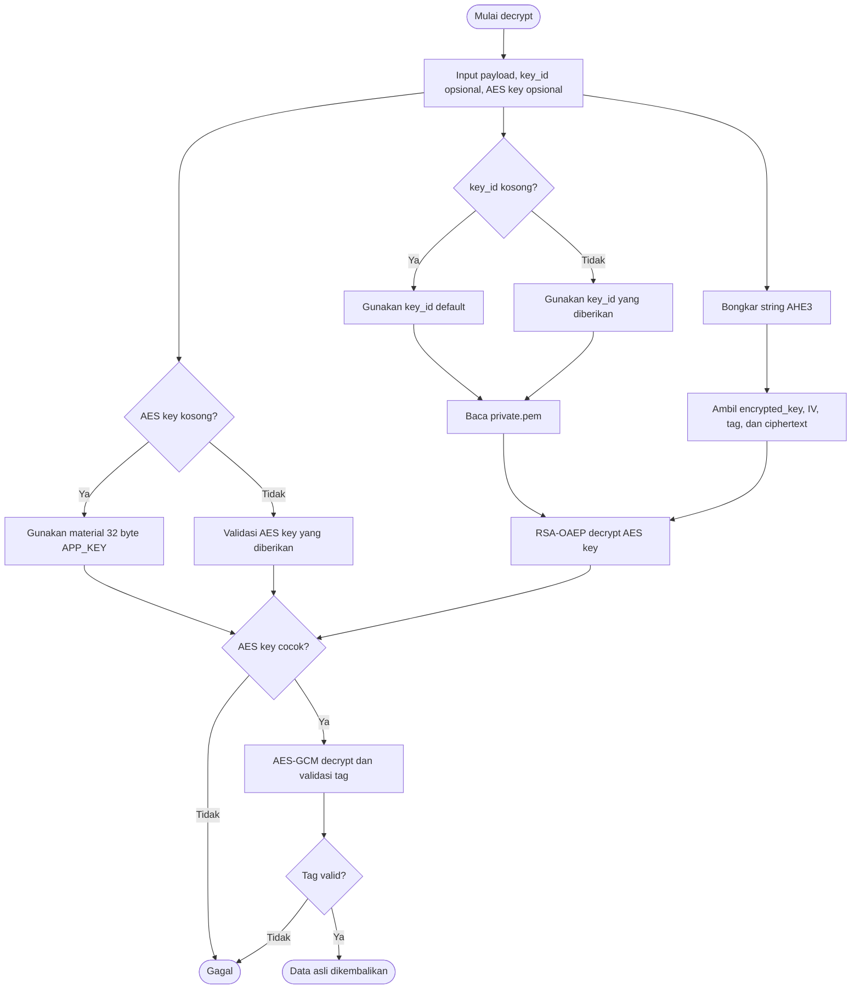

# Panduan penggunaan

Dokumen ini berisi alur kerja, konfigurasi, pembuatan key, dan integrasi antar
aplikasi Laravel.

## Alur generate key pair



Private key tidak pernah perlu dikirim ke client. AES key generated hanya
ditampilkan sekali dan harus segera diamankan aplikasi.

## Alur encrypt



## Alur decrypt



## Konfigurasi

Publish konfigurasi:

```bash
php artisan vendor:publish --tag=hybrid-encryption-config
```

Konfigurasi utama berada di `config/hybrid-encryption.php`:

```php
return [
    'cipher' => 'aes-256-gcm',
    'rsa_bits' => (int) env('APTIKA_HYBRID_ENCRYPTION_RSA_BITS', 3072),
    'key_storage' => [
        'disk' => env('APTIKA_HYBRID_ENCRYPTION_KEY_DISK', 'local'),
        'visibility' => env('APTIKA_HYBRID_ENCRYPTION_KEY_VISIBILITY', 'private'),
        'public_prefix' => env(
            'APTIKA_HYBRID_ENCRYPTION_PUBLIC_PREFIX',
            'hybrid-encryption/keys/public'
        ),
        'private_prefix' => env(
            'APTIKA_HYBRID_ENCRYPTION_PRIVATE_PREFIX',
            'hybrid-encryption/keys/private'
        ),
    ],
];
```

Public dan private key memakai disk yang sama, tetapi prefix berbeda:

```text
storage/app/hybrid-encryption/keys/public/default/public.pem
storage/app/hybrid-encryption/keys/private/default/private.pem
```

`disk` adalah nama disk Laravel, bukan folder private. `visibility` default
adalah `private`.

## Command

```bash
php artisan aptika-hybrid-encryption:generate-key-pair
php artisan aptika-hybrid-encryption:generate-key-pair users/10/profile
php artisan aptika-hybrid-encryption:generate-key-pair features/bantuan --aes-source=generated
php artisan aptika-hybrid-encryption:generate-aes-key
php artisan aptika-hybrid-encryption:revoke-key-pair
php artisan aptika-hybrid-encryption:revoke-key-pair users/10/profile
```

`key_id` default adalah `default`. Saat key lama akan ditimpa atau dicabut,
command meminta jawaban `5` untuk validasi `2 + 3`, kecuali menggunakan:

```bash
php artisan aptika-hybrid-encryption:generate-key-pair default --force
php artisan aptika-hybrid-encryption:revoke-key-pair default --force
```

Mode `app_key` memakai `APP_KEY` Laravel. Mode `generated` membuat AES key
acak 32 byte, menampilkannya sekali, dan tidak menyimpan file AES.

## Generate dari controller

```php
use Aptika\HybridEncryption\Services\AesKeyService;
use Aptika\HybridEncryption\Services\HybridEncryptionService;
use Aptika\HybridEncryption\Services\KeyPairService;
use Illuminate\Http\Request;

public function generate(
    Request $request,
    KeyPairService $keys,
    AesKeyService $aes,
    HybridEncryptionService $crypto,
) {
    $validated = $request->validate([
        'key_id' => ['nullable', 'string', 'max:190'],
        'aes_source' => ['nullable', 'in:app_key,generated'],
    ]);

    $keyId = trim((string) ($validated['key_id'] ?? '')) ?: 'default';
    $source = $validated['aes_source'] ?? 'app_key';
    $aesKey = $source === 'generated' ? $aes->generate() : null;
    $paths = $keys->generate($keyId);

    return response()->json([
        'success' => true,
        'key_id' => $paths['key_id'],
        'disk' => $paths['disk'],
        'visibility' => $paths['visibility'],
        'public_path' => $paths['public_path'],
        'private_path' => $paths['private_path'],
        'aes_source' => $source,
        'aes_fingerprint' => $crypto->aesKeyFingerprint($aesKey),
        'aes_key' => $aesKey,
    ]);
}
```

Endpoint ini harus dibatasi untuk administrator atau proses internal. Jangan
mengembalikan isi `private.pem`.

## Integrasi antar aplikasi Laravel

Misalnya App1 mengenkripsi data untuk App2:

1. Buat key pair di App2.
2. App1 memakai public key App2 berdasarkan `key_id` yang sama.
3. App1 dan App2 memakai `APP_KEY` yang sama, atau AES generated yang sama.
4. App1 mengirim string `AHE3.` melalui HTTPS.
5. App2 memakai private key untuk decrypt.

Pengirim:

```php
$payload = $crypto->encrypt(
    ['nik' => '750101xxxxxxxxxx', 'nama' => 'Alfandy'],
    'features/antar-project'
);

Http::withBody($payload, 'text/plain')
    ->post('https://app2.test/api/receive');
```

Penerima:

```php
public function receive(Request $request)
{
    return response()->json([
        'success' => true,
        'data' => HybridEncryption::decrypt(
            $request->getContent(),
            'features/antar-project'
        ),
    ]);
}
```
